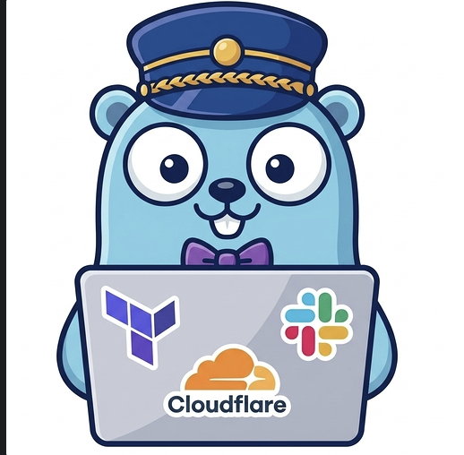
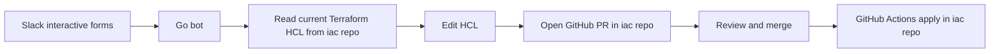

<p align="center">

</p>

<p align="center">
<a href="https://github.com/jae-labs/conCIerge/actions/workflows/ci.yml"></a>
<a href="https://github.com/jae-labs/conCIerge/actions/workflows/release.yml"></a>
<a href="src/go.mod"></a>
<a href="LICENSE"></a>
</p>

Slack-driven Terraform changes, reviewed through GitHub.

conCierge is a Go Slack bot for self-service infrastructure changes in `jae-labs`. It collects requests through Slack forms, edits Terraform HCL with HashiCorp HCL libraries, and opens GitHub pull requests. GitHub Actions applies changes only after normal review and merge.

This repo contains the Go Slack Bot and Ansible host configuration. The actual Terraform IaC codebase has been moved to a dedicated repository named `iac`.

---

## Workflow



conCierge does not apply infrastructure directly. It prepares a normal code change and leaves the production boundary at GitHub review, merge, and path-scoped GitHub Actions workflows in the `iac` repository.

---

## Repository Structure

| System | Path | Purpose |
| :--- | :--- | :--- |
| **conCierge bot** | `src/` | Go Slack bot that drives forms, HCL edits, GitHub branches, commits, and PRs in the `iac` repo. |
| **Ansible host config** | `ansible/` | Post-provision OCI host configuration for running the bot in production. |

Detailed subsystem docs live with each subsystem:

| Document | Scope |
| :--- | :--- |
| [`src/README.md`](src/README.md) | Bot architecture, supported workflows, environment variables, tests, and releases. |
| [`ansible/README.md`](ansible/README.md) | OCI host configuration, bot service deployment, Docker installation, nginx, certbot, and telemetry. |

---

## CI/CD Workflow Triggers

Path-scoped GitHub Actions:

- Bot changes (`src/**`) trigger the bot CI and release pipeline (`ci.yml`, `release.yml`).
- Host configuration changes (`ansible/**`) trigger CI checks.
- Note: Terraform apply workflows are managed entirely within the `iac` repository.

---

## Prerequisites

- Go 1.25+
- Ansible
- Doppler CLI
- Slack Application configuration (Socket Mode for local development, HTTP events for production)
- GitHub App credentials (installation ID and private key) granted permissions to the `iac` repository

## Local Development

Use Doppler for secrets.

```sh
doppler login
doppler setup
```

Run bot:

```sh
cd src
doppler run -- go run ./cmd/concierge
```

Apply Ansible host config:

```sh
cd ansible
doppler run -- bash bootstrap.sh
doppler run -- ansible-playbook -i inventory/oci.oci.yml playbooks/site.yml
```
