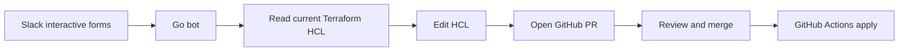

<p align="center">

</p>

<p align="center">
<a href="https://github.com/jae-labs/conCIerge/actions/workflows/ci.yml"></a>
<a href="https://github.com/jae-labs/conCIerge/actions/workflows/release.yml"></a>
<a href="src/go.mod"></a>
<a href="terraform/"></a>
<a href="https://goreportcard.com/report/github.com/jae-labs/conCIerge"></a>
<a href="LICENSE"></a>
</p>

Slack-driven Terraform changes, reviewed through GitHub.

conCierge is a Go Slack bot for self-service infrastructure changes in `jae-labs`. It collects requests through Slack forms, edits Terraform HCL with HashiCorp HCL libraries, and opens GitHub pull requests. GitHub Actions applies changes only after normal review and merge.

This repo also contains the Terraform and Ansible used to run conCierge: OCI infrastructure, DNS, Doppler secrets, host config, nginx, systemd, releases, and telemetry.

---

## Workflow



conCierge does not apply infrastructure directly. It prepares a normal code change and leaves the production boundary at GitHub review, merge, and path-scoped GitHub Actions workflows.

---

## Repository Structure

| System | Path | Purpose |
| :--- | :--- | :--- |
| **conCierge bot** | `src/` | Go Slack bot that drives forms, HCL edits, GitHub branches, commits, and PRs. |
| **Terraform IaC** | `terraform/` | Root modules for GitHub, Cloudflare, Doppler, and OCI infrastructure. |
| **Ansible host config** | `ansible/` | Post-provision OCI host configuration for running the bot in production. |

Detailed subsystem docs live with each subsystem:

| Document | Scope |
| :--- | :--- |
| [`src/README.md`](src/README.md) | Bot architecture, supported workflows, environment variables, tests, and releases. |
| [`terraform/README.md`](terraform/README.md) | Terraform root modules, state layout, provider prerequisites, and apply workflow. |
| [`ansible/README.md`](ansible/README.md) | OCI host configuration, bot service deployment, Docker installation, nginx, certbot, and telemetry. |

---

## CI/CD Workflow Triggers

Path-scoped GitHub Actions:

- Bot changes (`src/**`) trigger the bot CI and release pipeline (`ci.yml`, `release.yml`).
- GitHub module changes (`terraform/github/**`) trigger `github-apply.yml`.
- Cloudflare module changes (`terraform/cloudflare/**`) trigger `cloudflare-apply.yml`.
- Doppler module changes (`terraform/doppler/**`) trigger `doppler-apply.yml`.
- OCI module changes (`terraform/oci/**`) trigger `oci-apply.yml`.

---

## Prerequisites

- Go 1.25+
- Terraform >= 1.5
- Ansible
- Doppler CLI
- `gcloud` CLI authenticated with GCS state bucket access
- Slack Application configuration (Socket Mode for local development, HTTP events for production)
- GitHub App credentials (installation ID and private key)

## Local Development

Use Doppler for secrets.

```sh
doppler login
doppler setup
```

Run bot:

```sh
cd src
doppler run -- go run ./cmd/concierge
```

Plan Terraform:

```sh
cd terraform/<module>
doppler run -- terraform init
doppler run -- terraform plan
```

Apply Ansible host config:

```sh
cd ansible
doppler run -- bash bootstrap.sh
doppler run -- ansible-playbook -i inventory/oci.oci.yml playbooks/site.yml
```
