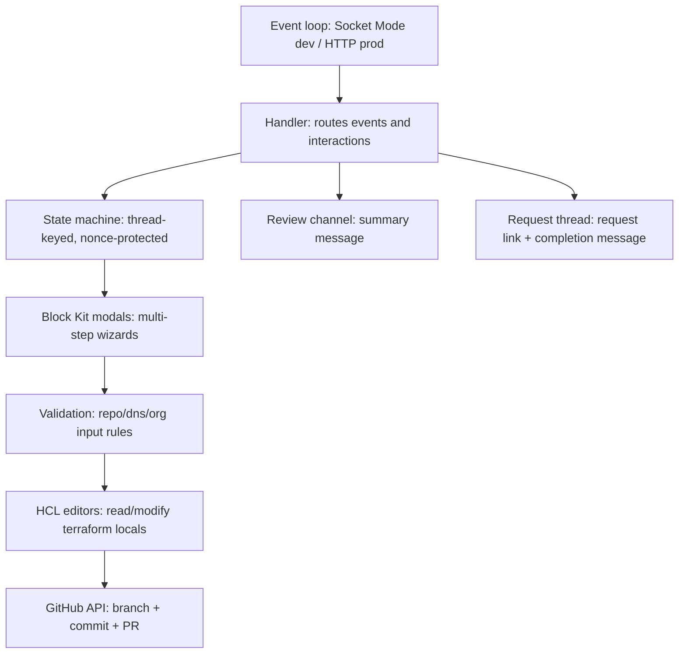
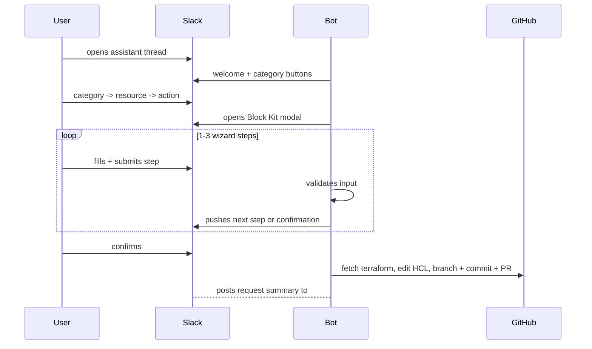

# conCierge Slack Bot

Go Slack bot providing self-service infrastructure workflows via Slack modals. Uses Socket Mode (WebSocket) for development and HTTP event subscriptions for production.

## What it does

- Create, update, and delete GitHub repositories
- Add, update, and delete Cloudflare DNS records
- Update GitHub org settings and repo settings (visibility, features, branch protection, team access)

Each workflow collects input via multi-step Block Kit modals, manipulates HCL in terraform locals files, creates a branch and PR via the GitHub API, and posts a summary to `#concierge`.

## Architecture



Terraform files live at the root of the dedicated `iac` repository. The bot targets the `iac` repo by default (via `GITHUB_REPO` environment variable).

### Conversation flow



## Documentation

| Document | Description |
|---|---|
| [Architecture](docs/architecture.md) | Package map, state machine, request lifecycle, IaC coupling |
| [Adding a Resource Type](docs/adding-a-resource-type.md) | Step-by-step guide for adding new terraform resource support |
| [Validation Patterns](docs/validation-patterns.md) | Input validation rules per resource type |
| [Modals and Blocks](docs/modals-and-blocks.md) | Block Kit patterns, wizard flows, ID pairing |

## Supported workflows

| Category | Resource | Actions |
|---|---|---|
| GitHub | Repository | Add, Remove, Update |
| GitHub | Org Settings | Update |
| GitHub | User Management | Add to Team, Remove from Team, Change Role |
| Cloudflare | DNS Records | Add, Remove, Update |
| Doppler | — | Coming soon |

## RBAC

Three role tiers control access:

| Role | Can use bot |
|---|---|
| User (`SLACK_USER_IDS`) | Yes |
| Manager (`SLACK_MANAGER_IDS`) | Yes |
| Admin (`SLACK_ADMIN_IDS`) | Yes |

## Packages

| Package | Description |
|---|---|
| `internal/config` | Loads and validates environment variables |
| `internal/conversation` | Thread-keyed state machine; State, RepoConfig, DnsConfig, OrgConfig structs |
| `internal/github` | GitHub App authenticated client (branch, file, PR operations, PR templates) |
| `internal/hcl` | HCL text editors for reading and writing terraform locals files (repos, DNS, org) |
| `internal/observability` | OpenTelemetry setup, structured slog logger, Prometheus-compatible metrics handler |
| `internal/slack` | Event handler (Socket Mode for dev, HTTP for prod), Block Kit modals, interaction routing, input validation, and request summary postings |

## Environment variables

| Variable | Description |
|---|---|
| `SLACK_MODE` | Runtime mode. Defaults to `socket`. Set to `http` for Slack Events API delivery behind nginx. |
| `SLACK_BOT_TOKEN` | Bot OAuth token (`xoxb-...`) |
| `SLACK_APP_TOKEN` | App-level token for Socket Mode (`xapp-...`); required only when `SLACK_MODE=socket` |
| `SLACK_SIGNING_SECRET` | Slack signing secret; required only when `SLACK_MODE=http` |
| `SLACK_HTTP_LISTEN_ADDR` | HTTP listen address for `http` mode. Defaults to `127.0.0.1:8080`. |
| `SLACK_REQUESTS_CHANNEL_ID` | Channel ID for posting request summaries to `#concierge` |
| `SLACK_USER_IDS` | Comma-separated Slack user IDs (basic access) |
| `SLACK_MANAGER_IDS` | Comma-separated Slack user IDs (manager access) |
| `SLACK_ADMIN_IDS` | Comma-separated Slack user IDs (admin access) |
| `GITHUB_APP_ID` | GitHub App ID |
| `GITHUB_APP_INSTALLATION_ID` | GitHub App installation ID |
| `GITHUB_APP_PRIVATE_KEY` | GitHub App private key (PEM). For systemd/env-file deployments, `\n` escapes are also accepted and normalized at runtime. |
| `GITHUB_OWNER` | GitHub organisation name |
| `GITHUB_REPO` | Terraform repo (default: `conCIerge`) |
| `OTEL_SERVICE_NAME` | Service name attached to traces and metrics. Defaults to `concierge`. |
| `OTEL_ENVIRONMENT` | Deployment environment resource attribute. Defaults to `development`. |
| `OTEL_EXPORTER_OTLP_ENDPOINT` | Optional OTLP traces endpoint (for example `127.0.0.1:4317`). Leave empty to keep traces local-only. |
| `OTEL_EXPORTER_OTLP_PROTOCOL` | OTLP transport: `grpc` (default), `http`, `http/protobuf`, or `http/json`. |
| `METRICS_ENABLED` | Enables the local Prometheus-compatible `/metrics` endpoint when `true`. Defaults to `false`. |
| `METRICS_LISTEN_ADDR` | Loopback-only listen address for `/metrics`. Defaults to `127.0.0.1:9090`. |
| `SENTRY_DSN` | Optional Sentry DSN for error reporting. |
| `SENTRY_ENVIRONMENT` | Optional Sentry environment. Defaults to `OTEL_ENVIRONMENT`. |
| `SENTRY_RELEASE` | Optional Sentry release identifier. |

Copy `.env.example` to `.env` and populate before running.

## Observability

| Capability | Behavior |
|---|---|
| Structured logs | Uses `slog`; non-local environments default to JSON output. |
| Trace/log correlation | `trace_id` and `span_id` are included on context-aware logs when spans are active. |
| Traces | OTLP export is optional; when no endpoint is configured, spans stay local and are not exported. |
| Metrics | Prometheus-compatible `/metrics` endpoint is exposed only when `METRICS_ENABLED=true`. |
| Sentry | Optional panic, HTTP, and Slack workflow error reporting when `SENTRY_DSN` is configured. |
| Listener safety | `METRICS_LISTEN_ADDR` must use a loopback host (`127.0.0.1`, `localhost`, or `::1`). |

## Development

Live reload with [air](https://github.com/air-verse/air):

```sh
air
```

## Build and run

```sh
go build ./cmd/concierge/
./concierge
```

Local development uses Socket Mode by default. For remote deployment, run the same binary with `SLACK_MODE=http` behind nginx and point Slack request URLs at `/slack/events`. The HTTP server also exposes `GET /health` for external uptime checks.

## Test

```sh
go test ./...
```

## CI and releases

The bot now follows the same GitHub Actions model as `jae-labs/flashcards`, adapted to this monorepo's `src` module path.

| Workflow | Trigger | Behavior |
|---|---|---|
| `ci.yml` | Pushes to `main` and pull requests that touch `src/**` or the bot workflow files | Runs lint, test, cross-platform build, and security scan jobs for the bot |
| `release.yml` | Pushes to `main` that touch `src/**` or the bot workflow files | Builds Linux and macOS release artifacts, creates the next patch release, refreshes the `latest` release, and deploys the released Linux amd64 binary to production via Ansible |

Release assets are published from `cmd/concierge` with these names:

| Platform | Asset name |
|---|---|
| Linux amd64 | `concierge-linux-amd64` |
| Linux arm64 | `concierge-linux-arm64` |
| macOS amd64 | `concierge-darwin-amd64` |
| macOS arm64 | `concierge-darwin-arm64` |
