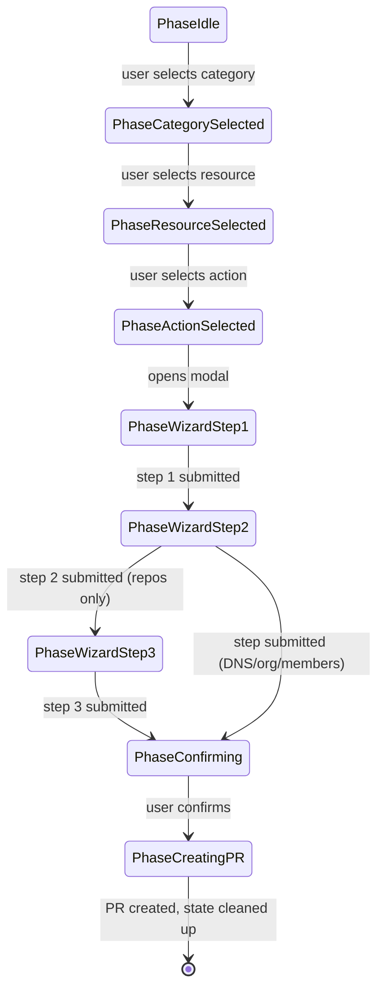
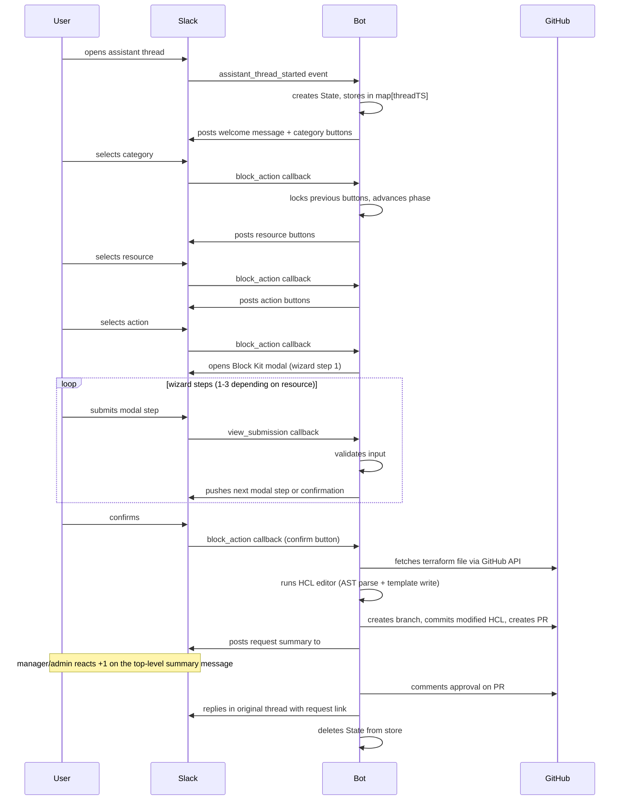

# Architecture

How the conCierge bot is structured, key files, data flow, and IaC coupling.

## Package map

| Package | Key files | Responsibility |
|---|---|---|
| `cmd/concierge` | `main.go` | Entry point: loads config, initializes clients (Slack, GitHub), observability, and runtime servers |
| `internal/config` | `config.go` | Env var loading; Slack user/manager/admin role sets parsed from comma-separated IDs; observability env validation |
| `internal/conversation` | `state.go`, `repo.go`, `dns.go`, `org.go`, `team_member.go` | Thread-keyed state machine with nonce protection; config structs for each resource type |
| `internal/github` | `client.go`, `pr.go` | GitHub App auth client: file ops, branch/commit/PR creation; outbound API spans and metrics; PR title/description/branch name builders |
| `internal/hcl` | `editor.go`, `dns_editor.go`, `org_editor.go`, `member_editor.go` | HCL text editors: reads via AST parsing (hcl/v2), writes via Go templates + string insertion; double-validates output |
| `internal/observability` | `observability.go`, `logger.go` | OpenTelemetry provider setup, resource attributes, Prometheus-compatible metrics handler, slog trace correlation |
| `internal/slack` | `handler.go`, `http.go`, `blocks.go`, `*_validation.go` | Event routing, Block Kit modals, interaction handling, input validation, inbound HTTP instrumentation, outbound Slack API spans/metrics, PR creation flows |

## State machine



## Request lifecycle



## Observability runtime

| Area | Implementation |
|---|---|
| Logger | `cmd/concierge/main.go` installs the `internal/observability` slog logger. Non-local environments default to JSON logs. |
| Trace propagation | `internal/observability.Setup()` installs OTEL tracer, meter, resource attributes, and W3C trace/baggage propagators. |
| Inbound Slack HTTP | `internal/slack/http.go` wraps `/slack/events` with `otelhttp.NewHandler(...)` for request spans and HTTP metrics. |
| Outbound Slack API | `internal/slack/handler.go` wraps `PostMessage`, `OpenView`, `PublishView`, `GetUserInfo`, and related Web API calls with spans, counters, and latency histograms. |
| Outbound GitHub API | `internal/github/client.go` wraps GitHub operations with OTEL spans, counters, histograms, and an instrumented HTTP transport. |
| Workflow telemetry | PR creation and PR approval paths emit workflow spans plus counters/histograms keyed by workflow, resource, action, and outcome. |
| Metrics endpoint | `cmd/concierge/main.go` exposes `/metrics` only when `METRICS_ENABLED=true`; `METRICS_LISTEN_ADDR` is validated as loopback-only for local Alloy scraping. |
| Sentry | `cmd/concierge/main.go` captures panics and HTTP errors; `internal/slack` captures handled workflow failures with step and trace tags. |

## Runtime env vars

| Variable | Default | Purpose |
|---|---|---|
| `OTEL_SERVICE_NAME` | `concierge` | Service name resource attribute for traces and metrics |
| `OTEL_ENVIRONMENT` | `development` | Deployment environment resource attribute |
| `OTEL_EXPORTER_OTLP_ENDPOINT` | empty | Optional OTLP traces exporter endpoint |
| `OTEL_EXPORTER_OTLP_PROTOCOL` | `grpc` | OTLP transport: `grpc`, `http`, `http/protobuf`, `http/json` |
| `METRICS_ENABLED` | `false` | Enables the Prometheus-compatible `/metrics` listener |
| `METRICS_LISTEN_ADDR` | `127.0.0.1:9090` | Loopback-only metrics listen address |
| `SENTRY_DSN` | empty | Optional Sentry DSN for error reporting |
| `SENTRY_ENVIRONMENT` | `OTEL_ENVIRONMENT` | Sentry environment |
| `SENTRY_RELEASE` | empty | Optional Sentry release identifier |

## Config structs

### RepoConfig

| Field | Type |
|---|---|
| Name | string |
| Description | string |
| Visibility | string |
| Topics | []string |
| TeamAccess | map[string]string |
| DefaultBranch | string |
| HasIssues | bool |
| HasWiki | bool |
| HasProjects | bool |
| HasDiscussions | bool |
| HomepageURL | string |
| AllowAutoMerge | bool |
| AllowUpdateBranch | bool |
| DeleteBranchOnMerge | bool |
| EnableBranchProtection | bool |
| RequiredReviews | int |
| DismissStaleReviews | bool |
| RequireLinearHistory | bool |
| RequireConversationResolution | bool |

### DnsConfig

| Field | Type | Notes |
|---|---|---|
| RecordKey | string | |
| Type | string | A, AAAA, CNAME, MX, TXT |
| Name | string | |
| Content | string | |
| Proxied | bool | A/AAAA/CNAME only |
| Priority | int | MX only |
| Comment | string | |

### OrgConfig

| Field | Type |
|---|---|
| Name | string |
| BillingEmail | string |
| Blog | string |
| Description | string |
| Location | string |
| MembersCanCreateRepos | bool |
| DefaultRepoPermission | string (read/write/admin/none) |
| WebCommitSignoffRequired | bool |
| DependabotAlerts | bool |
| DependabotSecurityUpdates | bool |
| DependencyGraph | bool |

### TeamMemberConfig

| Field | Type | Notes |
|---|---|---|
| Team | string | |
| Username | string | |
| Role | string | member or maintainer |

## IaC coupling

The bot fetches terraform files at runtime via GitHub API to populate modals and validate input, then writes modified HCL back via PR.

Path constants (defined in `handler.go`):

```
pathGitHubRepos   = "terraform/github/locals_repos.tf"
pathGitHubMembers = "terraform/github/locals_members.tf"
pathGitHubOrg     = "terraform/github/locals_org.tf"
pathCloudflareDNS = "terraform/cloudflare/locals_dns.tf"
```

Impact rules:

| Change | Required updates |
|---|---|
| Rename/restructure terraform files | Bot breaks at runtime (path constants are hardcoded) |
| Add field to terraform resource | HCL editor, Block Kit modal, handler parser, conversation state struct, confirmation blocks |
| Modify HCL block structure | HCL editor AST parsing, test fixtures in `internal/hcl/testdata/` |

Test fixtures in `internal/hcl/testdata/` must mirror production terraform file structure.

## Nonce protection

Each flow gets a unique nonce: unix-nano + atomic counter, base36-encoded. Embedded in modal `PrivateMetadata` as `threadTS:nonce`. Handlers validate nonce before processing -- prevents stale callbacks from superseded flows.

## RBAC

Role-based access comes from comma-separated env vars:

| Role | Env var | Permissions |
|---|---|---|
| User | `SLACK_USER_IDS` | Initiate flows |
| Manager | `SLACK_MANAGER_IDS` | Initiate flows and approve requests |
| Admin | `SLACK_ADMIN_IDS` | Initiate flows and approve requests |

Checked via `isAuthorized()` and `isApprover()`.

## Store

In-memory `map[string]*State` keyed by thread timestamp. Thread-safe via `sync.Mutex`. State created on flow start, deleted after PR creation or cancel. No persistence -- restart loses in-flight flows.
